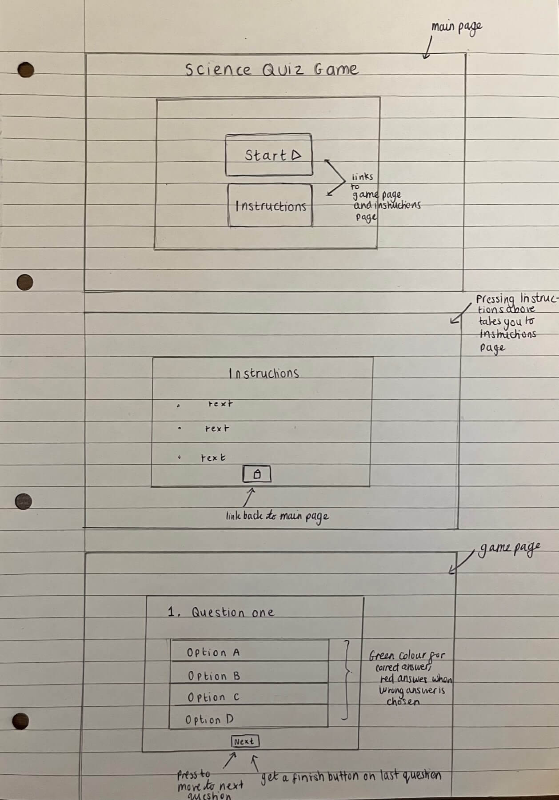
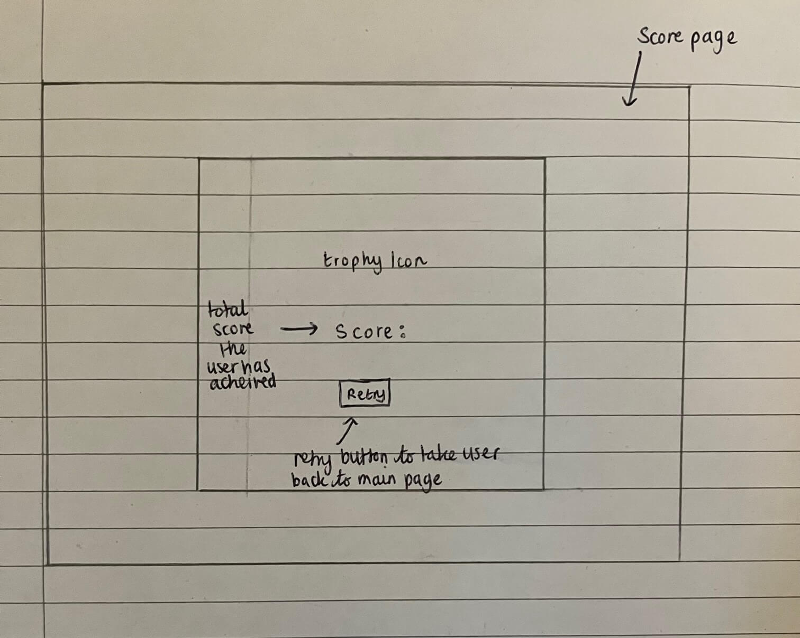
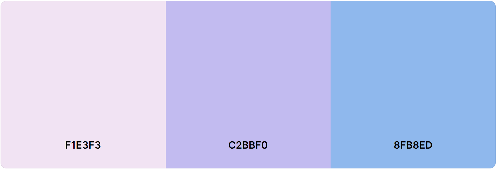
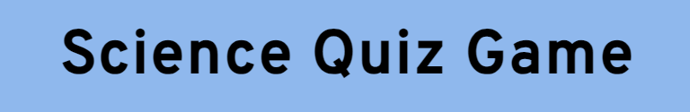
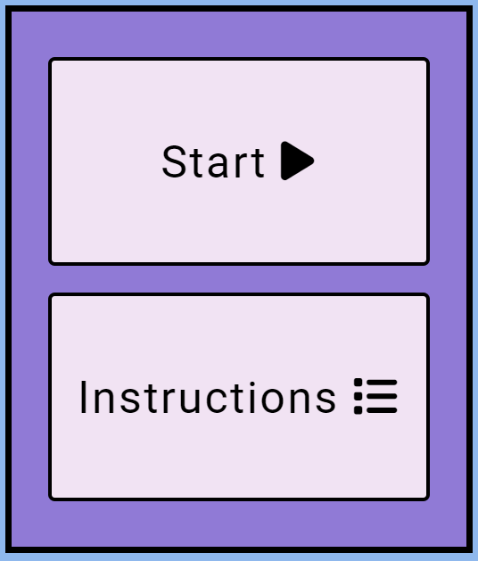
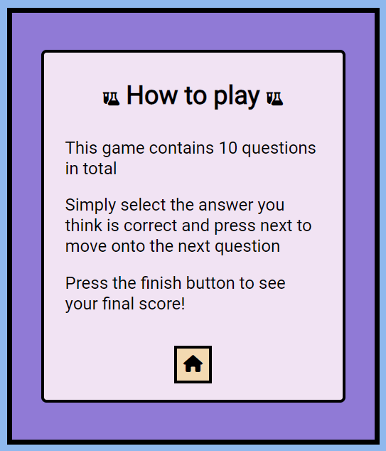
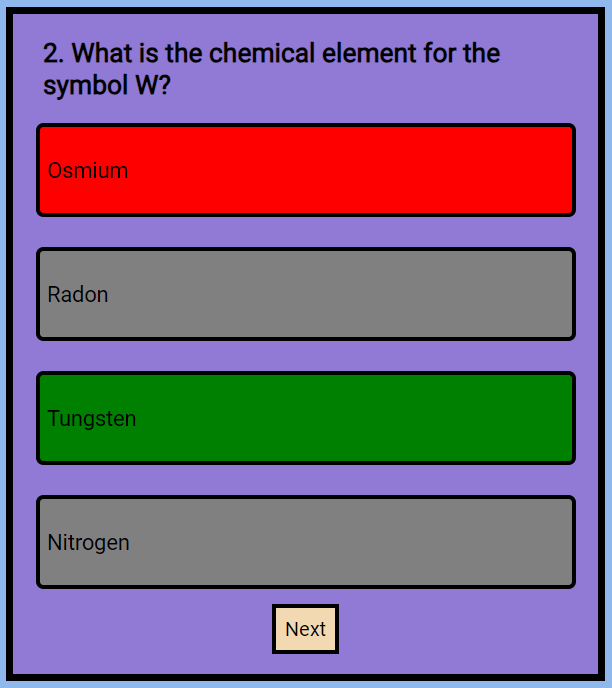
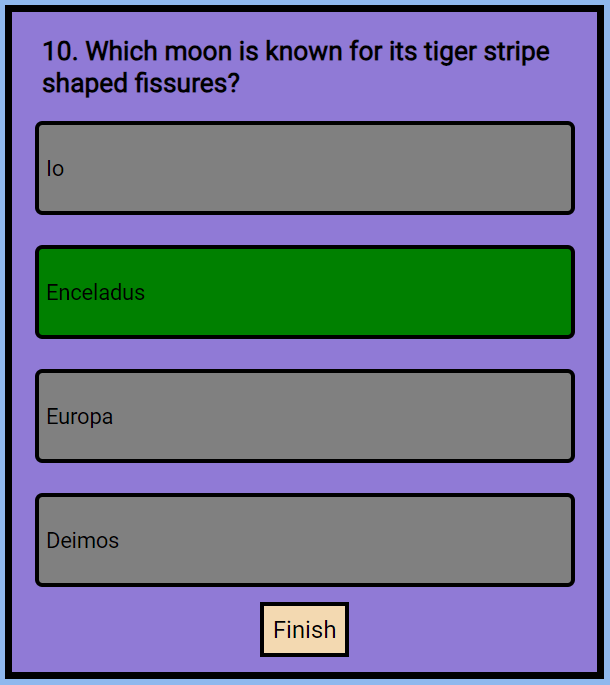
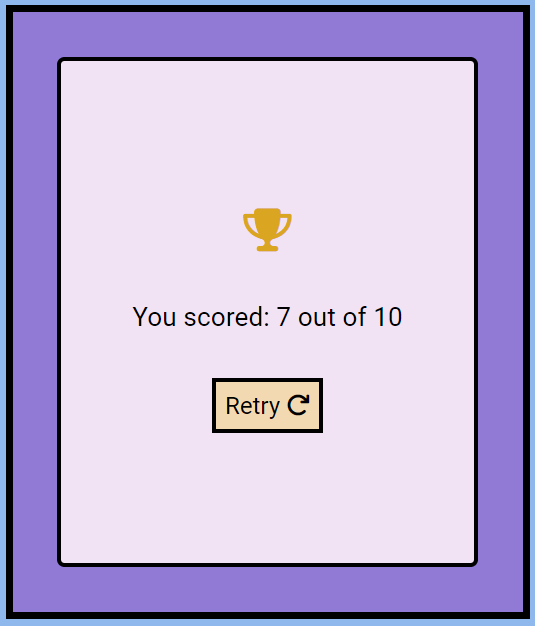

# Science Quiz Game
The aim of this project was to create a fun and interactive science themed quiz game for users to test their scientific knowledge.

am i responsive 

# Table of contents
- [UX](#ux)
  - [Site Purpose](#site-purpose)
  - [Audience](#audience)
  - [Communication](#communication)

- [Design](#design)
  - [Wireframes](#wireframes)
  - [Colour Scheme](#colour-scheme)
  - [Typography](#typography)

- [Features](#features)
  - [Existing Features](#existing-features)
  - [Future Features](#future-features)

- [Testing](#testing)
  - [Validator Testing](#validator-testing)
  - [Further Testing](#further-testing)

- [Programs Used](#programs-used)

- [Deployment](#deployment)

- [Credits](#credits)
  - [Content](#content)
  - [Media](#media)

# UX
### Site Purpose
The purpose of this quiz game is to allow users who are intersted in science to test their general scientific knowledge, by answering a series of 10 thought-provoking science questions. 

### Audience
The target audience is for people who have a scientific background or people who have an interest in science and would like to test their knowledge.

### Communication
- As the aim was to create a fun and interactive quiz game, I wanted the overall site to reflect this. Combining blue and purple as the main background colours give the site a fun feel along with the many icons used. 
- Throughtout the site, I have used the hover selector to allow most buttons and icons to change colour upon user interaction, making the site highly interactive.
- The site displays excellent contrast through the use of black text against the coloured background. The use of Overpass and Roboto as the font further aids in user readability, as these fonts are simple and easy to follow.
- The site is intuitivley designed, allowing the user to easily make their way from start to finish, with an option to replay the game at the end if the user wishes to do so.

# Design
### Wireframes
I sketched my wireframes out by hand as it gave me more control in documenting my thoughts and design ideas

### Colour Scheme
I used [coolors.co](https://coolors.co/) to find a colour scheme I could take inspiration from. I decided on using all three shades from the below colour palette:

When combining both #C2BBF0 and #8FB8ED together from the above palette, I felt a darker shade of purple would go better, so I used #907AD6 instead. Using blue and purple together creates a fun feel for the site and rather than using dull colours. I also decided to use blue and purple as I felt these colours (especially blue) represent the science theme nicely. To allow the black coloured text to have maximum contrast against the background shades, I used #F1E3F3 in the above palette for all button and text containers.

### Typography
All fonts were sourced from [Google Fonts](https://fonts.google.com/). I chose to use Overpass as the font for the main title of "Science Quiz Game", appearing in all pages of the site and Roboto for all other text. I used these two fonts as I felt they paired well together. Both are simple and easy to read, but at the same time they add a nice styling effect and increase the visual attractiveness of the site compared to using the basic Sans-Serif font.

# Features
### Existing Features
#### Page Title
The page title is placed at the top of every page to keep the site consistant.

#### Main Menu Links
Within the homepage, the user is presented with the following links to navigate to the quiz or to the instructions section.

I chose to create seperate HTML pages for each section as it made most sense to me to do it this way. Both links are clear and have an associated icon to further symbolise to the user what each link entails. When the user hovers over each icon, they become coloured, increasing the site interactivity.

#### Instructions Section
The instructions section contains a heading with icons at either side. The icons are relevant as they depict scientific glassware and I chose to include this as I thought it added a fun touch. Also included in this section are three simple lines of instructions to give a basic overview to the user on how to play the quiz. Lastly, I have included a link at the bottom of this section which takes the user back to the homepage after they have finished reading the instructions. I chose to incude a home icon as the link rather than text, as it makes the page less text heavy.

#### Quiz Section
When the user clicks start on the hompage, they are directed to the quiz section. In this section the user is presented initially with a question and four possible answers. If the user selects the right answer, the selected answer will turn green and the rest will become grey. If the user selects a wrong answer, it will turn red and the correct answer will highlight green, as shown below:

This provides further interactivity for the user as they can see if they got the question correct instantly, or if they got it wrong and what the correct answer is, providing a learning experience. All answers buttons become disabled after the user has selected and answer and the next button appears as shown above, which allows the user to move onto the next question.

#### End of Quiz Section
Once the user has made it to the end of the quiz, the user is then presented with a finish button, which links to the score page to reveal the overall score the user has accumulated. As with all other buttons and links within the site, when the user hovers over the finish link, the background colour will change to a lighter shade of beige to signal to the user that they can press this button. I have chosen to structure this section in this way as its an easy to follow layout with lots of chances for the user to interact with the quiz, creating better user experience.

#### Score Section
Once the user presses finish, they are taken to the score page, where the user is presented with a trophy icon, their score out of ten and a retry link to take the user back to the homepage to try again.
I added a trophy icon as it creates a sense of achievement for the user. The text which reveals the score is big and clear to read and below is the retry link which has an included arrow icon to signify that pressing this link will restart the game.

#### Footer
The footer is implemented across all pages in the site. I chose to include a footer as this allows a way for the user to be able to contact me if they experience any issues while playing, by clicking on the social media icons which all link to the relevant social media website.

### Future Features
To further improve my quiz game, the following features could be added:
- A timer to give 10 seconds for each question before moving onto the next question.
- More questions and the questions having the abilty to be shuffled, so every time the user plays they are presented with a new set of questions to maintain user interest.
- Difficulty levels which would be useful for people who would like more or less of a challenge.